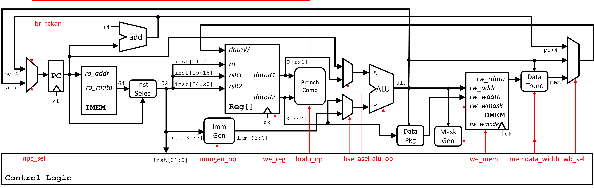
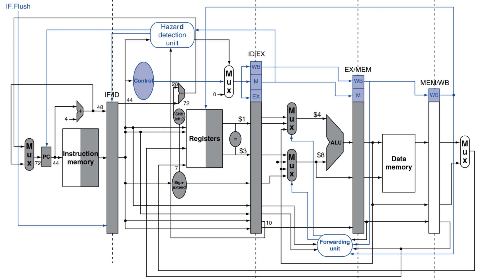
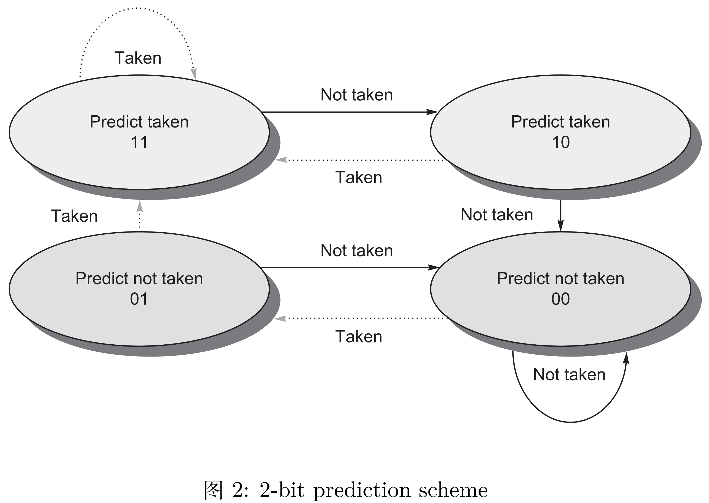
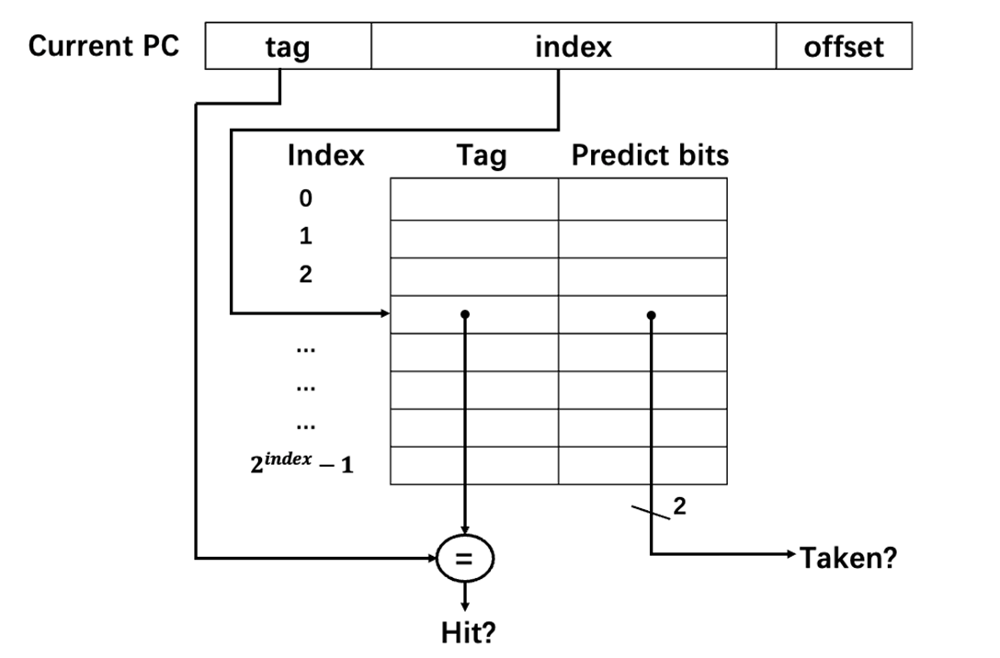
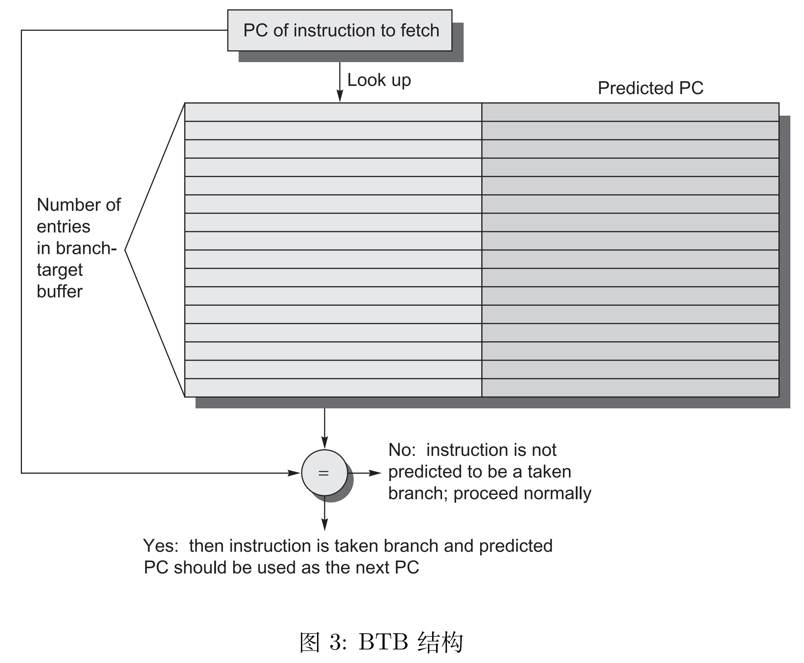
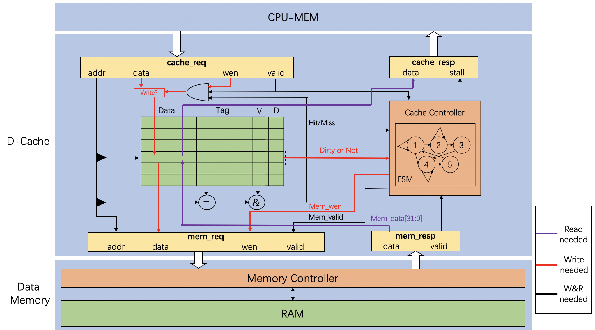

## 硬件部分

硬件部分实现使用 Verilog、SystemVerilog 等硬件描述语言实现基于 RISC-V 指令集(version20191213)的五级流水线CPU架构。

整体系统架构：

在能正常执行指令的情况下实现下列功能的优化和添加：

  功能实现包括：
  - 流水线 CPU 中的停顿（stall）和转发（forwarding）处理

    stall指的是流水线CPU在运行过程中在出现寄存器赋值不及时或相互冲突时，通过让后续指令暂停执行直到前方指令执行结束来使得后续指令正常运行的一种方法。本项目中由于指令之间是顺序执行，故只存在RAW（读后写），即后继指令需要读取一个寄存器的值，而前驱指令尚未将结果写回该寄存器。

    本项目中通过追踪当前指令写入寄存器的信号和下一条指令读取寄存器的信号来判断是否存在RAW冲突，如果发生冲突则控制后续指令的流动，使其暂时等待，等待前序指令执行成功之后再继续执行。

    forwarding是在stall的基础上实现的。因为在我们的流水线中从一条指令的结果被计算出来，到这个数值被写回寄存器，仍然需要一个时钟周期。而在此时，下一条指令是已经可以获取到这个数值的。forwarding（前递）就是为了实现这一数据在尚未写回寄存器时就向前传递给后面指令的操作，以减少stall的时间。

    

  - 特权指令处理（CSR 寄存器流水线）
    
    CSR 流水线部分负责处理 CSR 寄存器的读写操作，本项目实现csrrw、csrrs、csrrc等六条指令。在实现上和前述流水线基本一致，主要不同在于该流水线会根据自己的信号来修改前述流水线中的部分信号的值，起到权限控制的作用。

  - 基于分支历史表（BHT）和分支目标缓冲区（BTB）的动态分支预测

    BHT是用来存储跳转地址和跳转历史的缓存，当遇到跳转指令时通过对比之前保存在缓存中的地址和跳转信息来预测是否跳转。
    
    代码中采用2-bit来表示历史跳转信息，并使用状态机来预测跳转情况：
    
    我们将地址的低位部分作为索引，然后将高部分作为tag来判断是否是该地址：
    

    BTB是用来保存预测的跳转的地址。如果BHT中预测为跳转，则在BTB里面查找对应的跳转地址作为下一条指令的地址。
    
    
  - 二路组相连缓存（Cache）

    Cache 作为 CPU 和内存之间的存储结构，能够利用其速度快、容量小的特点，在速度相差较大的两种硬件之间，起到协调两者数据传输速度差异的作用。

    本项目代码中实现的是二路组相连缓存，即每一个index对应2个CacheLine。

    Cache分为控制部分和存储部分
    
    控制模块负责维护用于管理 Cache 状态的有限状态机，同时对 Cache 同上层 CPU 与下层 Memory 的交互起到调控作用。
    
    存储模块中则是 Cache 中存储的实际内容，一般为了保证 Cache 功能的正确实现，每个 Block 还需要辅助 Tag（地址高位）、V（有效位）、D（脏数据）等信息进行管理。

    相关策略：

    write alloc：写失配时将数据从内存载入 cache，便于之后多次读写该数据的时候可以从内存得到数据；
    
    write back：写命中时仅修改 cache，当 cacheline 被挤出 cache 时写回内存，避免每次写数据的时候都写内存；
    
    read 优先：当发生 write alloc 需要将 cacheline 挤出 cache 并且将脏数据写回内存时，首先将数据载入 cache、同时将被挤出 cache 的数据暂存到 cache buffer，然后将被挤出 cache 的数据写回内存，这样 piepline 读 cache 的数据和 CMU 将数据写回内存可以并行，pipeline 无需等待 cache back 的时间，提高执行效率。

    
  - 内存管理单元（MMU），实现虚实地址翻译和访问权限控制

    > 这部分采用RISC-V的SV39分页模式
  
    虚实地址翻译：在用户访问内存时，将用户访问的虚拟地址翻译为实际的物理地址，以便 CPU 对实际的物理地址进行访问；
    
    访问权限控制：可以对一些虚拟地址进行访问权限控制，以便于对用户程序的访问权限和范围进行管理，如代码段一般设置为只读，如果有用户程序对代码段进行写操作，系统会触发异常。
    
    正常来说，MMU应该放在Core和Memory之间的部分。本项目中为了简单实现，选择将MMU封装在Core内，即从Core发出的内存访问信号直接就是转化之后的地址，同样权限检查也在Core内部进行。